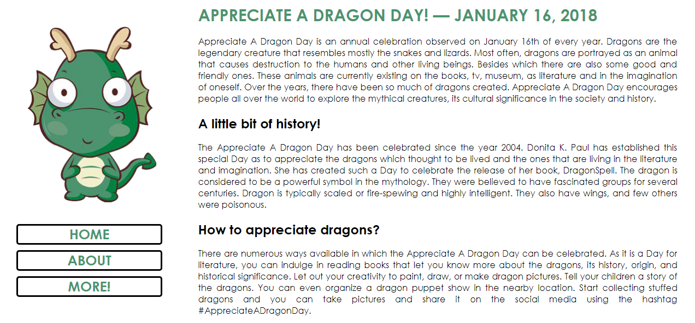

# VIVIXX Code Camp - Challenge #1

### Appreciate a Dragon Day!

The first Vivixx Code Camp Challenge is about HTML and CSS. The objective of the challenge is to:

  - Make a three-page website dedicated to DRAGONS!
  - Use the magic of HTML and CSS
  - Make a navigation area where you can "navigate" through the three-pages.

### Todos

- Add more pictures of dragons since its so plain and minimalistic.